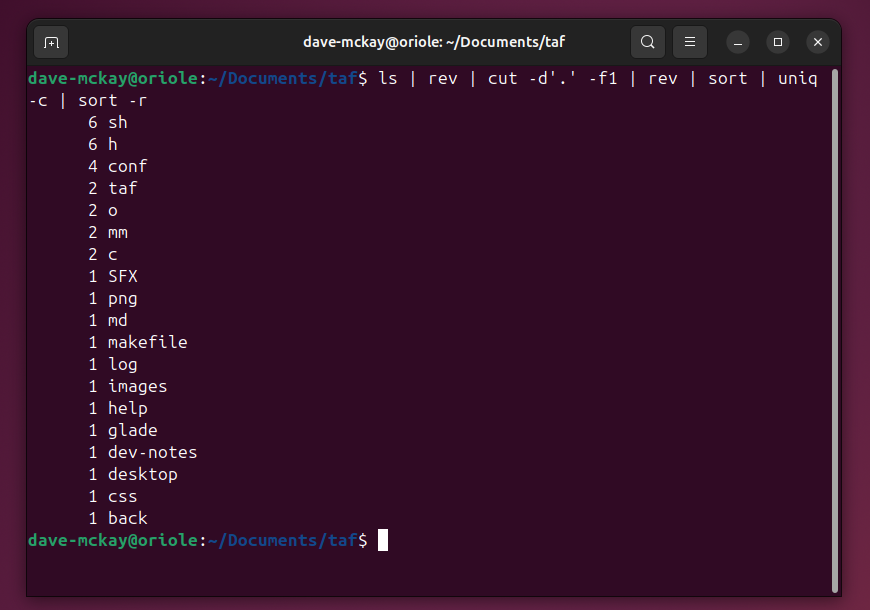

# 5 Reasons to Start Using the Linux Command Line

> ## Excerpt
> Your new superpower.

---
You can use Linux without mastering the command line and messing round in terminal windows. But if you do, you’ll miss out on the command line’s speed, power, and low-level fine-grained control.

## What's the Fuss About?

Some swear by it, some swear at it. We’re talking about the command line, that venerable human-computer interface that’s been around for over fifty years and still isn’t going anywhere soon. Even in today’s world of swish graphical interfaces and touch-screen convenience, there’s a place for the command line.

Back when Unix was [developed in the late 1960s](https://www.howtogeek.com/440147/did-linux-kill-commercial-unix/) and very early 1970s, there was no such thing as a [graphical user interface](https://www.howtogeek.com/743404/what-is-ui-and-what-does-it-stand-for/) (GUI), nor a [desktop environment](https://www.howtogeek.com/808226/what-is-gnome-in-linux/) (DE). Typing was the only game in town. If you wanted to interact with a computer, you used a keyboard, and you didn’t think twice about it.

This had design implications. Because you were limited to typing, every aspect of the computer’s configuration, operation, and administration had to be controllable by typing commands. That was true of Unix over half a century ago, and it’s still true of Linux today. You can do anything from the command line. Nothing is beyond your reach.

Today, at its core, Linux is still a keyboard-driven operating system. You can have a complete Linux system running without a desktop environment, and many servers are used in that way. On the desktop, of course, most users have a DE.

Open a terminal window though, and you’ve got full access to the command line, which means you’ve got access to all the Linux commands and every setting governing your Linux installation.

## 1\. Improve Your System Administration Skills

If you’re going to administer Linux systems, even casually for friends, family, and colleagues, you’re going to run up against a lot of different distributions, and a variety of DEs too.

Using the command line lets you do what you can’t do through the GUI of an application or through the settings DE itself. The DE and graphical applications are layers of abstraction between you and Linux. There might be tools to help you administer your Linux installation, but they won’t have the fidelity that the command line has.

Linux commands can have dozens of options. The more complicated the command, the less chance all those options will be replicated in a GUI tool. Plus each DE will have its own applications and its own way of doing things. Instead of learning the GUI way for all DEs, it’s easier to open a terminal window and type the universal Linux commands that work everywhere. If there’s a command line tool that isn’t bundled with a particular distribution, you can quickly install it.

Sometimes, the choice is made for you. Knowing how to do things on the command line is the only way to administer a headless server that doesn't have a DE installed on it, or a remote machine when you only have SSH access to it.

## 2\. Increase Efficiency

Linux commands can have many options. It’s what makes them precise. Pick the options that do exactly what you need, and that’s exactly what will be done. And Linux commands are designed to work together. They can generate output that is accepted as input by other commands.

Chaining commands together like this is called [piping](https://www.howtogeek.com/438882/how-to-use-pipes-on-linux/). This command returns a list of file extensions in the current directory, and the number of each different type. Linux doesn’t have a command for this, but you can easily bolt one together using existing Linux commands.

```
ls | rev | cut -d<span>'.'</span> -f1 | rev | sort | uniq -c | sort -r
```

[ls](https://www.howtogeek.com/448446/how-to-use-the-ls-command-on-linux/) lists the files. The filenames are fed into the [rev](https://www.howtogeek.com/434180/how-to-use-the-rev-command-on-linux/) command, reversing the characters in each name. The [cut](https://www.howtogeek.com/775824/how-to-use-the-linux-cut-command/) command truncates each name after the first period it finds, if there is one. The second rev restores the string to its original order. This gives us a list of the extensions. The list is sorted, and [uniq](https://www.howtogeek.com/533406/how-to-use-the-uniq-command-on-linux/) counts the occurrences of each unique file extension. The list is then sorted again, in descending order.



That’s great, but it’s a lot to remember. Especially with commands that have a lot of options.

That’s where aliases help. An alias lets you pick a [memorable name for a custom command](https://www.howtogeek.com/439736/how-to-create-aliases-and-shell-functions-on-linux/) that invokes a complicated command line for you. Aliases can take parameters, too. If your command line is more like a small routine than a single command line, you can turn it into a shell function.

If you need a permanent record of the output, you can [redirect the output](https://www.howtogeek.com/435903/what-are-stdin-stdout-and-stderr-on-linux/) to a file instead of the terminal window. Adding "> file-count.txt" to the end of the command creates a file called file-count.txt containing the text that would have gone to the terminal window.

```
ls | rev | cut -d<span>'.'</span> -f1 | rev | sort | uniq -c | sort -r &gt; file-count.txt
```

Piping commands together and parceling up sequences of commands greatly improves your efficiency, with less to remember and less to type.

## 3\. Automate Tasks

When your command sequences outstrip shell functions, you can convert them to scripts, and create entire [shell language programs](https://www.howtogeek.com/808593/bash-script-examples/).

There’s no limit to what you can achieve with scripts. Any command you can use on the command line can be used in a script, along with the shell language constructs like [test and comparisons](https://www.howtogeek.com/770617/how-to-use-double-bracket-conditional-tests-in-linux/), [loops](https://www.howtogeek.com/815778/bash-for-loops-examples/), and [case](https://www.howtogeek.com/766978/how-to-use-case-statements-in-bash-scripts/) statements.

Tedious, repetitive tasks can be accomplished by running a script instead. If the script requires running at a particular time or with a certain frequency, you can set it to be launched automatically with a systemd [timer](https://www.howtogeek.com/replace-cron-jobs-with-systemd-timers/).

## 4\. Troubleshoot Problems

Troubleshooting issues with your computer is incredibly well-supported on the Linux command line. Doing so means you sidestep the obfuscation of the GUI and deal directly with the system.

Linux logs all sorts of events and processes, including the boot process. The log events can all be accessed through the systemd [journalctl](https://www.howtogeek.com/499623/how-to-use-journalctl-to-read-linux-system-logs/).

You can drill into hardware issues using tools like [lshw, lsblk, and lscpu](https://www.howtogeek.com/426199/how-to-list-your-computers-devices-from-the-linux-terminal/), and examine file system issues with [fsck](https://www.howtogeek.com/745921/how-to-use-the-fsck-command-on-linux/) and boot issues with [GRUB](https://www.howtogeek.com/830574/how-to-fix-the-linux-boots-into-the-bios-error/).

```
sudo lshw
```


Network and DNS issues can be investigated with [ip](https://www.howtogeek.com/657911/how-to-use-the-ip-command-on-linux/), [dig](https://www.howtogeek.com/663056/how-to-use-the-dig-command-on-linux/), host, and nslookup.

Performance issues can be identified using [top](https://www.howtogeek.com/668986/how-to-use-the-linux-top-command-and-understand-its-output/) or [htop](https://www.howtogeek.com/how-to-use-linux-htop-command/), iostat, [vmstat](https://www.howtogeek.com/424334/how-to-use-the-vmstat-command-on-linux/), and [netstat](https://www.howtogeek.com/513003/how-to-use-netstat-on-linux/).

## 5\. Access Remote Systems

You can log into remote Linux computers using SSH connections, giving you a terminal window on the remote machine, right on your own, local machine. With [SSH keys](https://www.howtogeek.com/424510/how-to-create-and-install-ssh-keys-from-the-linux-shell/) you can set up secure, passwordless connections.

If all you need to do is transfer files, you can use [rsync](https://www.howtogeek.com/427480/how-to-back-up-your-linux-system/) to synchronize directories or entire directory trees, back and forth between your computer and the remote computer. Of course, you can wrap these rsync commands in aliases, shell functions, or scripts, and run them automatically with systemd [timers](https://www.howtogeek.com/replace-cron-jobs-with-systemd-timers/).

___

The learning curve is worth it. Dive in, but pace yourself. You don't need to learn everything all at once, but every piece of information you pick up becomes another asset in your Linux toolkit.

Nobody ever became a good mechanic without lifting the bonnet.
