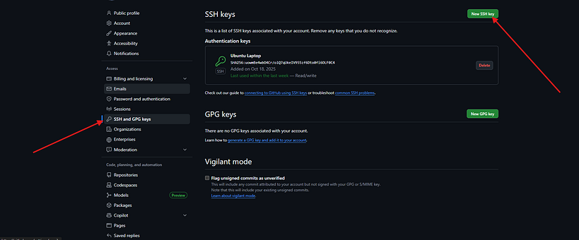
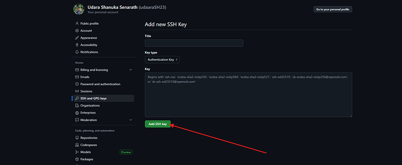

# How to Generate and Add SSH Key to GitHub (Complete Guide for Beginners) | by Udara Shanuka Senarath | Medium

> ## Excerpt
> How to Generate and Add SSH Key to GitHub (Complete Guide for Beginners) If you’ve ever had to type your GitHub username and password every time you push code or struggled with authentication …

---

4 min read

Oct 18, 2025

If you’ve ever had to type your GitHub username and password every time you push code or struggled with authentication issues. it’s time to switch to **SSH keys**.

SSH keys make it easier (and more secure) to connect your computer to GitHub no more typing credentials every time!

In this article, you’ll learn:

-   What an SSH key is
-   Why you should use SSH instead of HTTPS
-   How to generate an SSH key
-   How to add it to GitHub
-   How to test and verify your connection

Let’s dive in.

## What Is an SSH Key?

An **SSH key** (Secure Shell key) is a cryptographic key pair used to authenticate your computer to a remote server, in this case, GitHub.

It consists of:

-   **Private key** → stays on your computer (keep it secret!)
-   **Public key** → shared with GitHub or other services

When you push or pull code, GitHub verifies that your private key matches your registered public key without needing a password.

## Why Use SSH Keys for GitHub?

Here’s why developers prefer SSH:

1.  **Security:** Your private key is never sent over the internet.
2.  **Convenience:** No need to re-enter username or password.
3.  **Automation:** Perfect for CI/CD and GitHub Actions.
4.  **Speed:** Fewer authentication prompts = faster workflow.

## **Ok. Let’s Start.**

## Step 1 — Generate a New SSH Key

Open your terminal and run:

```
<span id="a375" data-selectable-paragraph="">ssh-keygen -t ed25519 -C <span>"your_github_email@example.com"</span></span>
```

> _Replace_ `_"your_github_email@example.com"_` _with the email linked to your GitHub account._

**Explanation:**

-   `ssh-keygen` → command to create a new SSH key pair
-   `-t ed25519` → specifies the encryption algorithm (modern, secure, and recommended by GitHub)
-   `-C` → adds a label (your email) for identification

## Step 2 — Choose Where to Save the Key

When prompted:

```
<span id="ff5c" data-selectable-paragraph="">Enter file <span>in</span> <span>which</span> to save the key (/home/username/.ssh/id_ed25519):</span>
```

Just press **Enter** to use the default location.

Then you’ll be asked:

```
<span id="a96b" data-selectable-paragraph="">Enter passphrase (empty <span>for</span> no passphrase):</span>
```

You can either:

-   Press **Enter** twice (no passphrase) for simplicity
-   Or add a passphrase for extra security (recommended if it’s your personal machine)

Your keys will be saved at:

-   **Private key:** `~/.ssh/id_ed25519`
-   **Public key:** `~/.ssh/id_ed25519.pub`

## Step 3 — Add SSH Key to Your SSH Agent

Now, start the SSH agent (a background program that manages keys):

```
<span id="c3c4" data-selectable-paragraph=""><span>eval</span> <span>"<span>$(ssh-agent -s)</span>"</span></span>
```

**What it does:**

-   Starts the ssh-agent in the background.
-   Sets up environment variables so your terminal knows how to communicate with it.

Then add your private key to it:

```
<span id="4ce0" data-selectable-paragraph="">ssh-add ~/.ssh/id_ed25519</span>
```

This ensures your key is available whenever you push or pull from GitHub.

## Get Udara Shanuka Senarath’s stories in your inbox

Join Medium for free to get updates from this writer.

**What this does:**

-   Loads your private key (`id_ed25519`) into the ssh-agent’s memory.
-   If you protected your key with a passphrase, you’ll be asked to enter it here.
-   Once added, the agent will automatically use this key for any SSH connection to GitHub (or other servers).

## What Is the SSH Agent?

The **ssh-agent** is a background program that securely stores your private keys in memory while your system is running.

When you try to connect to GitHub over SSH, the agent automatically provides the right key, so you don’t have to re-enter passphrases or manually reference your key every time.

Think of it like a **password manager for your SSH keys**.

**NOTE** : You only unlock your key once per session.If you don’t want to manually run these commands every time, you can configure your system to auto-load your SSH key when you log in.

For example, on Ubuntu:

1.  Edit your `~/.bashrc` or `~/.zshrc`
2.  Add these lines at the end:

```
<span id="e42e" data-selectable-paragraph=""><span>eval</span> <span>"<span>$(ssh-agent -s)</span>"</span><br>ssh-add ~/.ssh/id_ed25519</span>
```

## Step 4 — Copy Your Public Key

Run :

```
<span id="b332" data-selectable-paragraph=""><span>cat</span> ~/.ssh/id_ed25519.pub</span>
```

This will display a line starting with:

```
<span id="806f" data-selectable-paragraph="">ssh-ed25519 AAAAC3NzaC1lZDI1NTE5AAAAI...</span>
```

Copy **the entire line** (that’s your public key).

## Step 5 — Add SSH Key to GitHub

1.  Go to [GitHub → Settings → SSH and GPG keys](https://github.com/settings/keys)

Press enter or click to view image in full size



2\. Click **“New SSH key”**

Press enter or click to view image in full size



3\. Set a descriptive title (e.g., _Ubuntu Laptop_)

4\. Paste your copied key

5\. Click **“Add SSH key”**

## Step 6 — Test Your Connection

Now verify that everything works by running:

```
<span id="829d" data-selectable-paragraph="">ssh -T git@github.com</span>
```

If successful, you’ll see something like:

```
<span id="aa1a" data-selectable-paragraph="">Hi udara! You<span>'ve successfully authenticated, but GitHub does not provide shell access.</span></span>
```

## Bonus — Make Sure Your Repo Uses SSH Instead of HTTPS

If your repo was cloned using HTTPS, update its remote URL to SSH:

```
<span id="83e8" data-selectable-paragraph="">git remote set-url origin git@github.com:username/repository.git</span>
```

Now all future `git push` and `git pull` commands will use your SSH key automatically.
