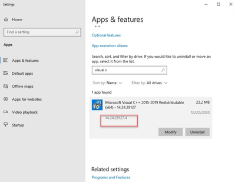

# Problem installing Power Automate Desktop - Power Platform Community

> ## Excerpt
> Hi,  I'm having some problems of installing Power Automate Desktop.  Installer always fails and I have been digging in to it, but haven't find working solution yet. In error log the issue seems to be the following:  "The installation failed. Service "UIFlowService" failed to start. Verify that you h...

---
Hello @Anonymous 

Please follow the below instructions and let us know, if it helps in fixing the issue:

(i) Ensure the .net version is 4.8 Runtime framework. If not download and install [https://dotnet.microsoft.com/download/dotnet-framework/net48](https://dotnet.microsoft.com/download/dotnet-framework/net48)  
(ii) Complete all pending Windows updates, if any.   
(iii) Uninstall ‘Power Automate Desktop” from Control Panel > Programs > Uninstall a Program  
(iv) Open File Explorer and navigate to %localappdata% >Microsoft and delete “Power Automate Desktop” folder.  
(v) Also, navigate to %programdata% > Microsoft and delete “Power Automate Desktop” folder.  
(vi) Download latest setup from PAD and reinstall (as admin if possible)   
(vii) If the same issue shows up, restart the system and reinstall using the same setup file.   
Note :- If a different setup is used after restarting the pc, the issue will continue. 

If the issue persists, check if the logs mentioned as vcredist64. (find using Ctrl+F)

(i) To navigate to logs: %programdata%\\microsoft\\power automate desktop\\logs.  
(ii) Then check the control panel. if this 64bit version of visual c++ redist exists. If yes, uninstall it manually and restart the pc.   
(iii) Launch the pad installer as admin and install again. 

(i) Access the Registry Editor and navigate to Computer\\HKEY\_LOCAL\_MACHINE\\SOFTWARE\\WOW6432Node\\Microsoft  
(ii) Check if Power Automate Desktop registry exists   
(iii) If it doesn't exist, it is a permission issue, you need to allow full control permissions to the Microsoft folder from the path: Computer\\HKEY\_LOCAL\_MACHINE\\SOFTWARE\\WOW6432Node\\Microsoft   
Right-click on folder -> Permissions -> Full Control   
(iv) Create Power Automate Desktop Key in the same path   
(v) Now install PAD   
(vi) Creating a Registry key with Power Automate Desktop under Computer\\HKEY\_LOCAL\_MACHINE\\SOFTWARE\\WOW6432Node\\Microsoft and give full control permissions to the all users, fixes the issue. 

  
If this post helps, then please Accept it as the solution to help the other members find it more quickly.

Regards,

Shalini M
